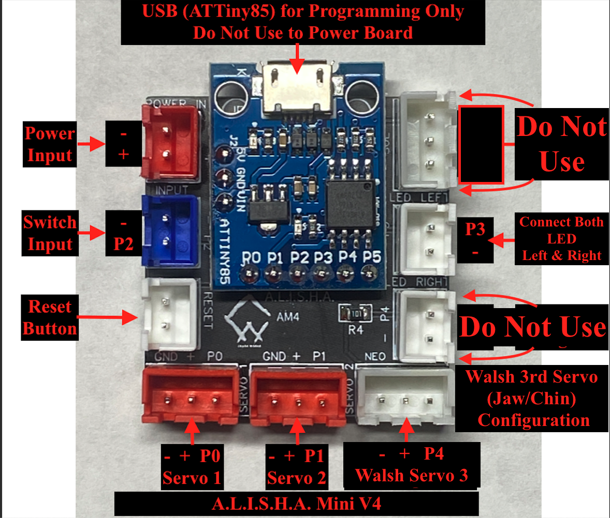

# Iron Man Servo for Crash Works 3D AM board

The purpose of this project is to automate features of the various models of the Iron Man 3D printed helmet.  This project was created with the purpose of enabling fans like you to be able to more easily make your own automated helmet. We encourage you to learn from this as well as provide feedback for us to improve upon it.

## Follow Me

[![alt text][1.1]][1]  [![alt text][2.1]][2]  [![alt text][3.1]][3]   [![alt text][4.1]][4]    [![alt text][9.1]][9]

[1.1]: images/instagram.png (Instagram - Crash Works 3D)
[2.1]: images/youtube.png (YouTube - Dropwire)
[3.1]: images/github.png (Github - Crash Works)
[4.1]: images/Thingiverse.png (Thingiverse - Crash Works)
[5.1]: images/youtube-preview.jpg (Crash Works 3d - MK85 Helmet Motorization Kit Test v1)
[6.1]: images/youtube-preview_MK7.JPG (Crash Works 3d - MK7 Helmet Motorization Kit Test v1)
[7.1]: images/youtube-preview_Mk46_Closed.JPG (Crash Works 3d - MK46 Helmet Motorization Kit Test v1)
[8.1]: images/youtube-preview_Legends.jpg (Crash Works 3d - Marvel Legends Iron Man / Punisher / War Machine Motorization Kit Test v1)
[9.1]: images/facebook.png (Facebook - Crash Works)
[1]: https://www.instagram.com/crash_works_3d/
[2]: https://www.youtube.com/channel/UCxbZNWPNsDoVIHJfYZQF2Jw
[3]: https://github.com/
[4]: https://www.thingiverse.com/crashworks3d/designs
[5]: https://www.youtube.com/watch?v=dDsZCZuzkQU
[6]: https://www.youtube.com/watch?v=P-p2FFcd4s8&feature=emb_logo
[7]: https://www.youtube.com/watch?v=9Ue6Bggzcgk&feature=emb_logo
[8]: https://www.youtube.com/watch?v=seIPFCSIgJs
[9]: https://www.facebook.com/groups/cosplayspecialeffectsprops

### Actual Use:

[![alt text][5.1]][5]
[![alt text][6.1]][6]
[![alt text][7.1]][7]
[![alt text][8.1]][8]

## Getting Started

It will be helpful but not necessary if you have a basic level of programming experience as well as a little experience programming Arduino micro controllers.  This project was created using the [Aurduino IDE](https://www.arduino.cc/).  Clone or download this repository at your own risk.

You can download the 3D printable servo kit from Thingiverse:

[Thingiverse MK85 Iron Man Servo Kit](https://www.thingiverse.com/thing:4607836)

[Thingiverse MK46 Iron Man Servo Kit](https://www.thingiverse.com/thing:4640029)

[Thingiverse MK7 Iron Man Servo Kit](https://www.thingiverse.com/thing:4630066)

[Thingiverse Marvel Legends Iron Man Servo Kit](https://www.thingiverse.com/thing:5175364)

**You can purchase an easy to install and use Arduino shield (Nano included) designed specifically for this project. This Board comes pre-flashed with the Crashworks code installed.**

**_A.L.I.S.H.A._ - Arduino nano Led & Integrated Servo Helmet Actuator for 3D Printed Helmets**

Purchase: [ebay - ALISHA Mini / PENELOPE](https://www.ebay.com/str/crashworks3d)

### Prerequisites

* Some experience with [Arduino](https://www.arduino.cc/)
* Download and install Arduino IDE from [here](https://www.arduino.cc/en/software).
* Download and install the ATtiny 85 Digispark board in the Arduino IDE following instructions from [here](http://digistump.com/wiki/digispark/tutorials/connecting)
* Download and install the [OneButton](https://github.com/mathertel/OneButton) libary.
* Download and install the [SendOnlySoftwareSerial](https://github.com/nickgammon/SendOnlySoftwareSerial) library.
* USB Micro cable capable of data transfer.
---
### Modifying code for the Walsh 85 helmet

In progress.  Instructions will be provided at a later date.

### Modifying code for sound

In progress.  Instructions will be provided at a later date.
### Modifying code for NeoPixels

In progress.  Instructions will be provided at a later date.

---
### Uploading Code To AM Board see: [UPLOAD_CODE](docs/UPLOAD_CODE.md)

---
## Button Functions
* Single Press: Faceplate open/close
* Double Press: LED brightness changes High/Med/Low/Off
---

## Built With

* [Arduino](https://www.arduino.cc/)

## Versioning

Version Beta 2.0 (Use at your own risk) 

## Authors

* **Dropwire**

* **Cranshark @ i3 Creations**

## License

This project is licensed under the MIT License - see the [LICENSE.md](LICENSE.md) file for details

## Acknowledgments/ Hat Tip
* [i3 Creations, LLC](https://github.com/i3creations)
* [Dropwire](https://github.com/Acollazo7)
* [Arduino](https://www.arduino.cc/)
